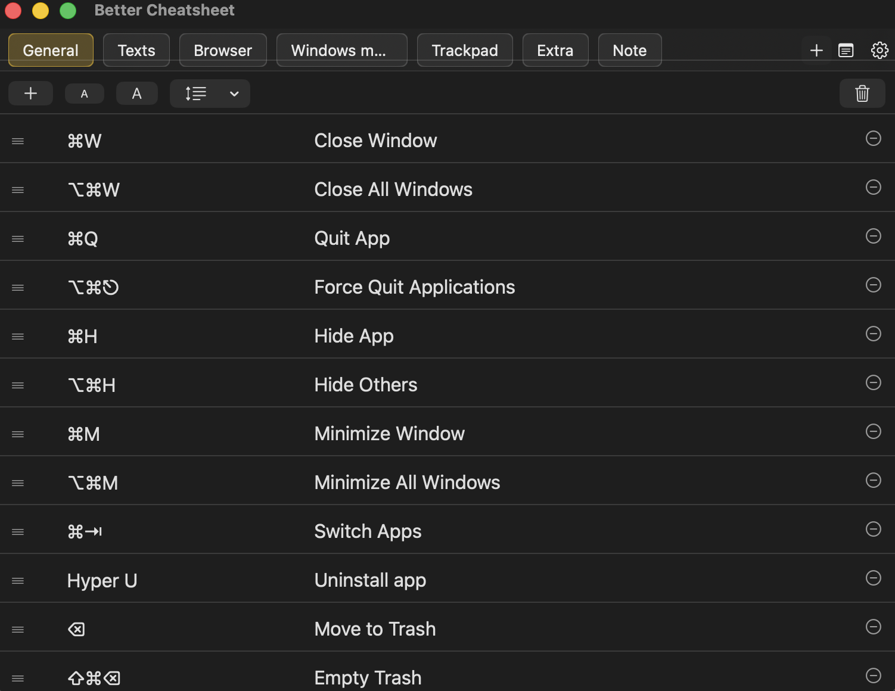
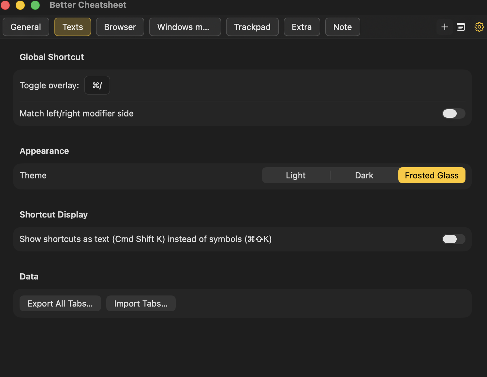
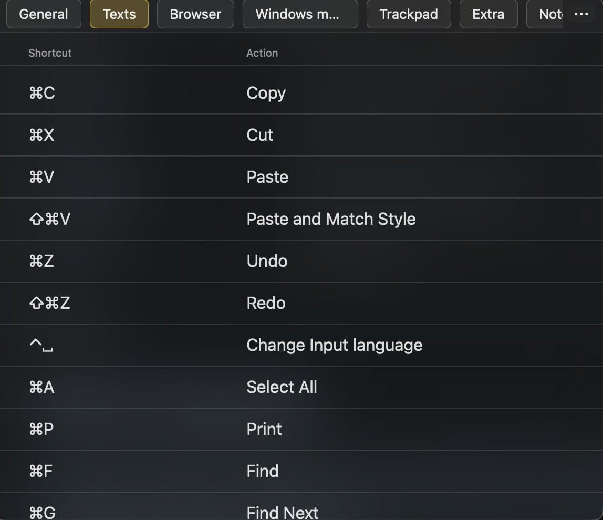

# Better Cheatsheet

A native macOS app for keeping notes on your custom keyboard shortcuts, with a global hotkey that pops up a floating "cheatsheet" overlay so you never have to leave what you're doing to remember one.

> This is a personal app I built to fit my own workflow. If it happens to fit yours too, feel free to download and use it — and I'd genuinely welcome any feedback.

## Screenshots

| Main window | Settings | Overlay |
| --- | --- | --- |
|  |  |  |

## Features

- **Three tab types**: via the "+" button, a templated two-column table for either **Keyboard Shortcuts** (physical modifier-key capture, see below) or **Trackpad Shortcuts** (an ALL-CAPS-keyword auto-replace instead, e.g. typing `CMD ` inserts "⌘ ", since trackpad gestures are described in longer free text) — or, via the note-icon button, a freeform rich-text Note tab. A tab's type is fixed at creation and can't be flipped afterward
- **Unlimited named tabs** for organizing shortcuts into groups, with drag-to-reorder for both tabs and, within a table tab, individual rows
- **Global hotkey** (default ⇧⌘K, fully re-recordable) toggles a floating overlay showing your notes over whatever app you're in — an ellipsis button in the overlay jumps straight back to the main editor
- **Per-tab overlay editing** — mark a Note tab "editable in overlay" to jot things down without opening the main window (table tabs are always read-only in the overlay)
- **Live shortcut capture** (Keyboard template only) in the Shortcut column: hold a modifier (⌘ ⇧ ⌥ ⌃) and it's inserted as its symbol the instant it's pressed, along with Space (␣), Return (⏎), and the arrow keys (↑ ↓ ← →); tapping Tab once inserts "⇥", tapping it twice quickly moves to the next field instead. Pressing all four modifiers at once (e.g. a Hyper key remapped from Caps Lock) inserts "Hyper " instead of stacking all four symbols; Fn inserts "fn "
- **Symbol or spelled-out display** — a Settings toggle shows shortcuts either as symbols (⌘⇧K) or spelled out (Cmd Shift K)
- Adjustable Shortcut column width, a shared table font size, and adjustable line spacing (1x/1.25x/1.5x/2x) for both table tabs and Note tabs
- **Left/right modifier matching** (optional) — make a shortcut trigger only on, say, the right Shift key, not either side
- **Light / Dark / Frosted Glass** themes (Frosted Glass applies to the overlay only)
- **Export/Import** — Settings has an Export All Tabs / Import Tabs pair to move every tab (Note tabs' rich text included) to another machine via a single file; importing lets you overwrite your current tabs or add the imported ones alongside them. [`Example-tabs.json`](./Example-tabs.json) in this repo is a real export you can import to see the format, or just to get a starter set of macOS/browser/trackpad shortcuts
- No network access of any kind; notes are stored locally only

## Install

Via Homebrew:

```
brew tap vhai2801/better-cheatsheet
brew install --cask better-cheatsheet
```

Update later with:

```
brew update && brew upgrade --cask better-cheatsheet
```

## Building from source

Requires only Xcode Command Line Tools (no full Xcode needed) — this is a Swift Package, not an Xcode project.

```
git clone https://github.com/vhai2801/BetterCheatsheet.git
cd BetterCheatsheet
./build.sh            # debug build
./build.sh --release   # release build
```

Either produces a real, double-clickable `BetterCheatsheet.app` (path printed at the end of the build).

## Notes

The app isn't notarized (no paid Apple Developer ID), so it's ad-hoc code signed. The Homebrew cask strips the quarantine flag on install so it launches without a Gatekeeper prompt; building from source and running it directly may show an "unidentified developer" warning on first launch — right-click the app and choose Open to bypass it.
